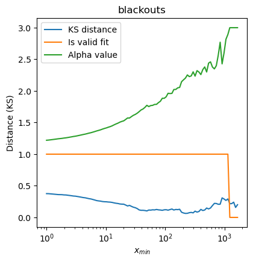
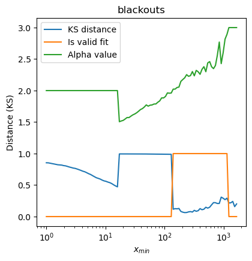

Advanced Topics
===============

This page covers many eclectic topics that don't fit elsewhere, and generally
are only relevant for advanced users.

No possible fits
----------------

When fitting a distribution to data, there may be no valid fits. This would
most typically arise from overly strict fitting requirements, but it could
also happen because the data truly doesn't fit the specified form. This
latter case is easy enough to test (just look at the PDF of the data), but
the former case can be a little harder to fix.

First, in order to diagnose this issue, you should look at the ``noise_flag``
property of either the ``Fit`` object (signifying that every value of ``xmin``
failed) or for a specific distribution object.

.. code-block::

    data = powerlaw.load_test_dataset('blackouts')

    # pl.noiseflag will be True since the powerlaw exponent of the
    # blackouts dataset should be around 2.4, outside of the prescribed
    # range.
    pl = powerlaw.Power_Law(data, parameter_ranges={"alpha": [1, 2]})
    pl.noise_flag

    # fit.noiseflag will be True since the prescribed sigma_threshold
    # is too low
    # range.
    fit = powerlaw.Fit(data, sigma_threshold=1e-12)
    pl.noise_flag

One way to fix this is by adjusting your parameter ranges, threshold, constraints,
etc. If you worry that the fitting landscape is too noisy, you can try
providing an explicit initial condition:

.. code-block::
    
    fit = powerlaw.Fit(data, initial_parameters={"alpha": 2.4})

If you're seeing a warning message about something, fixing that may help
to get better fitting results; see the tutorial about `dealing with warnings
<warnings.html>`_ for more information.

Multiple possible fits
----------------------

Changes in :math:`x_{min}` with different parameter requirements illustrate
that there may be more than one fit to consider. Assuming there is no
:math:`x_{max}`, the optimal :math:`x_{min}` is selected by finding the
:math:`x_{min}` value with the lowest distance (see ``xmin_distance`` keyword
for :class:`powerlaw.Fit`) between the data and the fit for that :math:`x_{min}`
value. If there is only one local minimum across all :math:`x_{min}` values,
this is philosophically simple.

If, however, there are multiple local minima in this distance metric across
:math:`x_{min}` with similar minimum values, it may be worth noting and
considering these alternative fits. For this purpose, :class:`powerlaw.Fit`
retains information on all the possible :math:`x_{min}`, along with the
parameters of the subsequent fit, in the ``xmin_fitting_results`` property.

As an example, let's examine the fitting results for the ``blackouts`` data:

.. code-block::

    data = powerlaw.load_test_dataset('blackouts')

    fit = powerlaw.Fit(data / 1e3)

    # Now examine the xmin fitting results
    plt.plot(fit.xmin_fitting_results["xmin"], fit.xmin_fitting_results["distance"])
   

    The Kolmogorov-Smirnov distance and :math:`\alpha` values for the resulting fit for every possible
    value of :math:`x_{min}` for the ``blackouts`` data set.

The first minima is at :math:`x_{min} = 50`, and has a distance value of .1
and an :math:`\alpha` value of 1.78. The second, more optimal, fit is at
:math:`x_{min} = 230`, with a distance of .06 and :math:`\alpha = 2.27`.
The reality of which of these is a better fit to the data will depend
on exactly what type of data you have, and isn't always obvious if there
are fits with similar distance values, as above.
For example, if you expect that the power law exponent should be restricted
to a specific range, say greater than 2, the second minima would be the
most correct choice. If you have expectations about such values, it is
a good idea to try and encode this in the parameter ranges or constraints
of fitting.

.. code-block::

    data = powerlaw.load_test_dataset('blackouts')

    fit = powerlaw.Fit(data / 1e3, parameter_ranges={"alpha": [2, 3]})

    ...

    The Kolmogorov-Smirnov distance and :math:`\alpha` values for the resulting fit for every possible
    value of :math:`x_{min}` for the ``blackouts`` data set while constraining
    :math:`\alpha` to be in the range :math:`[2, 3]`.

For more information, see the tutorial about `restricting fits with ranges and
constraints <ranges_and_constraints.html>`_.
 

Maximum likelihood and independence assumptions
-----------------------------------------------

A fundamental assumption of the maximum likelihood method used for fitting,
as well as the loglikelihood ratio test for comparing the goodness of fit of
different distributions, is that individual data points are independent [1].
In some datasets, correlations between observations may be known or expected.
For example, in a geographic dataset of the elevations of peaks, of the
observation of a mountain of height :math:`X` could be correlated with the
observation of foothills nearby of height :math:`X/10`. Large correlations
can potentially greatly alter the quality of the maximum likelihood fit.
Theoretically, such correlations may  be incorporated into the likelihood
calculations, but doing so would greatly increase the computational
requirements for fitting.
 
Depending on the nature of the correlation, some datasets can be "decorrelated"
by selectively omitting portions of the data [2]. Using the foothills
example, the correlated foothills may be known to occurr within 10km of a
mountain, and beyond 10km the correlations drops to 0. Requiring a minimum
distance of 10km between observations of peaks, and omitting any additional
observations within that distance, would decorrelate the dataset. 
 
An alternative to maximum likelihood estimation is minimum distance estimation,
which fits the theoretical distribution to the data by minimizing the
Kolmogorov-Smirnov (or some other) distance between the data and the fit.
This can be specified by passing ``fit_method='ks'`` to the ``Fit``; the
particular distance, whether Kolmogorov-Smirnov, Anderson-Darling, etc. is
controlled with the ``xmin_distance`` keyword. However, the use of this
option will not solve the problem of correlated data points for the
loglikelihood ratio tests used in :meth:`powerlaw.Fit.distribution_compare`.

Numerical fitting arguments
---------------------------

When numerical fitting is necessary (see tutorials on `other libraries <other_libraries.html>`_
or `continuous and discrete <discrete_continuous.html>`_), this library
uses ``scipy.optimize.minimize``. This function is incredibly deep and
decisions about parameter values could be discussed ad nauseam; we give a
brief overview of how this function is used here, but see the source code
--- particularly the :meth:`powerlaw.Distribution.fit` function --- for
more information.

As of v1.6.0, there are two options for fitting method used: Nelder-Mead
when there are no constraints, and COBYLA when there are constraints.
Both of these have been roughly tested across a range of distributions
(though primarily power laws) and they seem to work well enough. Otherwise,
there is no particular reason why these optimization methods are used.

References
----------

[1] Clauset, A., Shalizi, C. R., & Newman, M. E. J. (2009). Power-law
distributions in empirical data. SIAM Review, 51(4), 661–703.
https://doi.org/10.1137/070710111

[2] Klaus, A., Yu, S., & Plenz, D. (2011). Statistical Analyses Support
Power Law Distributions Found in Neuronal Avalanches. PLOS ONE, 6(5),
e19779. https://doi.org/10.1371/journal.pone.0019779

