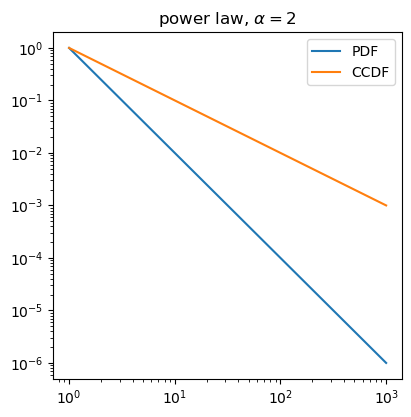
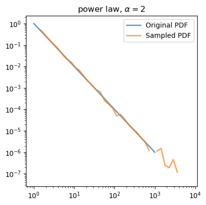
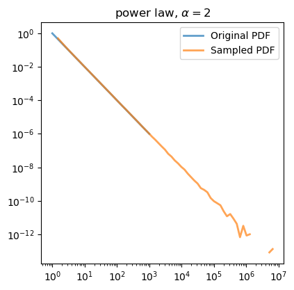
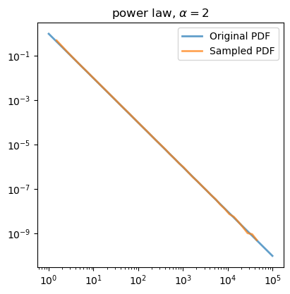
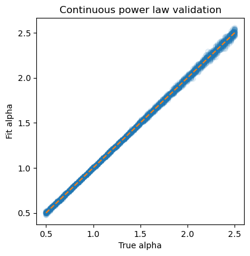

Generating data
===============

Creating simulated data drawn from a theoretical distribution is frequently
useful for a variety of tasks, including further modeling or simulations.
Individual ``Distribution`` objects can generate random samples with the
:meth:`Distribution.generate_random`.

Let's first create a distribution by manually specifying parameter values:

.. code-block::

    # Any of these are fine to create a power law with a specific
    # alpha value.
    pl = powerlaw.Power_Law(xmin=1, parameters={'alpha': 2.0})
    pl = powerlaw.Power_Law(xmin=1, parameters=[2.0])
    pl = powerlaw.Power_Law(xmin=1, alpha=2.0)

    pl.plot_pdf(label='PDF')
    pl.plot_ccdf(label='CCDF')

    A power law with exponent :math:`\alpha = 2`.

Now let's sample from that distribution, and plot the new PDF:

.. code-block::

    # The first argument is equivalent to `size` from all
    # numpy.random functions.
    samples = pl.generate_random((10000,))

    pl.plot_pdf(label='Original PDF')
    powerlaw.plot_pdf(samples, label='Sampled PDF')

    A power law with exponent :math:`\alpha = 2` generated by sampling
    from the manually defined distribution.

The random sampling will follow the properties of the parent distribution,
which means it will respect values of ``xmin`` and ``xmax`` (if provided).
In the above case, we didn't specify an ``xmax`` for our parent distribution,
so the random samples are unbounded on the upper side (though note that
we arbitrarily choose to only plot three decades of the original distribution).
If we generate sufficiently enough samples, we can see that the sampled distribution
extends much farther than the original, though again this is simply because
we chose to only plot three decades of the original one:

    A power law with exponent :math:`\alpha = 2` generated by sampling
    a large number of values from the manually defined distribution. Note
    how the sampled distribution contains rare values that extend beyond the
    curve of the original distribution.

If we instead provide a specific value for ``xmax``, our sampled distribution
will be restricted to the region :math:`[x_{min}, x_{max}]`.

.. code-block::

    pl = powerlaw.Power_Law(xmin=1, xmax=1e5, alpha=2.0)

    samples = pl.generate_random((10000,))

    pl.plot_pdf(label='Original PDF')
    powerlaw.plot_pdf(samples, label='Sampled PDF')

    A power law with exponent :math:`\alpha = 2` generated by sampling
    from the manually defined distribution in a bounded domain. 

This random generation is exactly the same for a distribution fit to some
data:

.. code-block::

    data = powerlaw.load_test_dataset('flares')

    # Note: no xmax, so the samples will be unbounded
    pl = powerlaw.Fit(data)
    samples = pl.generate_random((10000,))

    pl.plot_pdf(label='Original PDF')
    powerlaw.plot_pdf(samples, label='Sampled PDF')

.. figure:: ../images/flares_random_samples.png

    PDF of original ``flares`` data and random samples drawn from the
    power law fit.

This random sampling function is used, for example, to validate the
fitting algorithm against simulated data.

.. code-block::

    np.random.seed(0)

    alphaArr = np.linspace(0.5, 2.5, 100)
    numSamples = 30 # per alpha value
    N = 3000

    fitAlphaArr = np.zeros((len(alphaArr), numSamples))

    for j in range(len(alphaArr)):
        for k in range(numSamples):
            theoretical_dist = powerlaw.Power_Law(xmin=1, xmax=1e6, parameters=[alphaArr[j]])
            data = theoretical_dist.generate_random(N)

            fit = powerlaw.Fit(data, xmin=1, xmax=np.max(data))

            fitAlphaArr[j,k] = fit.power_law.alpha

    Results of fitting randomly generated data according to continuous
    power law distribution.
