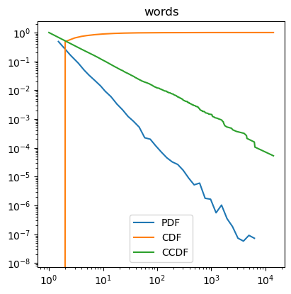

Visualization
=============

The ``powerlaw`` package supports easy plotting of the three relevant
functions for a distribution:

* the probability density function (PDF): :math:`p(x)`
* the cumulative distribution function (CDF): :math:`p(X<x)`
* the complementary cumulative distribution function (CCDF), also known as the survival function: :math:`p(X\geq x)`.

Even before trying to fit your data using the :meth:`powerlaw.Fit` class, you can
compute and visualize your data using the following functions:

.. autosummary::

    powerlaw.pdf
    powerlaw.cdf
    powerlaw.ccdf

.. autosummary::

    powerlaw.plot_pdf
    powerlaw.plot_cdf
    powerlaw.plot_ccdf

To plot the PDF and CDF of a dataset we might do:

.. code-block::

    import powerlaw

    data = powerlaw.load_test_dataset('words')

    # These accept matplotlib plot keywords like 'label'
    powerlaw.plot_pdf(data, label='PDF')
    powerlaw.plot_cdf(data, label='CDF')
    powerlaw.plot_ccdf(data, label='CCDF')
    plt.legend()
    plt.show()

    PDF, CDF, and CCDF for ``words`` dataset.

Note how when the PDF scales as a power law with some exponent :math:`\alpha`,
the CCDF scales as :math:`\alpha - 1`.

PDFs require binning of the data, and when presenting a PDF on logarithmic
axes the bins should have logarithmic spacing (exponentially increasing widths).
Although linear bins maintain a high resolution over the entire value range,
the greatly reduced probability of observing large values in the distributions
prevents a reliable estimation of their probability of occurrence. This is
compensated for by using logarithmic bins, which increases the likelihood
of observing a range of values in the tail of the distribution and normalizing
appropriately for that increase in bin width. Logarithmic binning is
``powerlaw``'s default behavior, but linearly spaced bins can also be dictated
with the ``linear_bins=True`` option to either :meth:`powerlaw.pdf` or 
:meth:`powerlaw.plot_pdf`.

Let's try it with the ``blackouts`` dataset:

.. code-block::

    data = powerlaw.load_test_dataset('blackouts')

    #powerlaw.plot_pdf(data, linear_bins=False, label='PDF')
    powerlaw.plot_pdf(data, linear_bins=True, label='PDF')
    plt.legend()
    plt.show()

.. subfigure:: ABC

    .. image:: ../images/blackouts_pdf.png

    .. image:: ../images/blackouts_pdf_linear.png

    .. image:: ../images/blackouts_pdf_linear_log.png

    PDF for the ``blackouts`` dataset with logarithmic binning on a logarithmic
    scale (left), linear binning on a linear scale (middle), and linear binning
    on a logarithmic scale (right).

The ``blackouts`` data shows a particularly severe example of why linear
binning can hurt visualization. The sparsity of the data leads individual
linear bins to have very few data points, including empty bins. The larger
logarithmic bins incorporate these empty regions of the data to create a
more useful visualization of the distribution's behavior.

As CDFs and CCDFs do not require binning considerations, CCDFs are frequently
preferred for visualizing a heavy-tailed distribution. However, CCDFs and CDFs
can make the data appear overly smooth and regular, and do not appear
straight if there is an upper bound on the distribution (see
`Identifying the scaling range <tutorials/scaling_range.html>`_). An empty
bin on the PDF, in contrast, will make evident choppiness in the data.
However, if the probability distribution has peaks in the tail this will be
more obvious when visualized as a PDF than as a CDF or CCDF. 

Individual ``Fit`` objects also include functions for computing and plotting
all three distributions. The theoretical PDF, CDF, and CCDFs of the constituent
``Distribution`` objects inside the ``Fit`` can also be plotted.

.. code-block::

    data = powerlaw.load_test_dataset('fires')

    fit = powerlaw.Fit(data)

    # Plot the distributions based on the data
    # No need to pass the data since the Fit already has it
    fit.plot_pdf(label='PDF')

    # Plot some fits fit.power_law.plot_pdf(linestyle='--', label='Power law fit')
    fit.exponential.plot_pdf(linestyle='--', label='Exponential fit')

    ...

.. figure:: ../images/fires_pdf_and_fit.png

    PDF for the ``fires`` dataset with power law and exponential fits.

Just like how these functions will automatically read the data from the
``Fit`` class, they will also inherit values for ``xmin`` and ``xmax``,
meaning only a portion of the data range may be shown.

To send multiple plots to the same axis in more complicated cases than the
ones above (where there only exists a single axis), pass the ``matplotlib.axes``
object with the keyword ``ax``.
